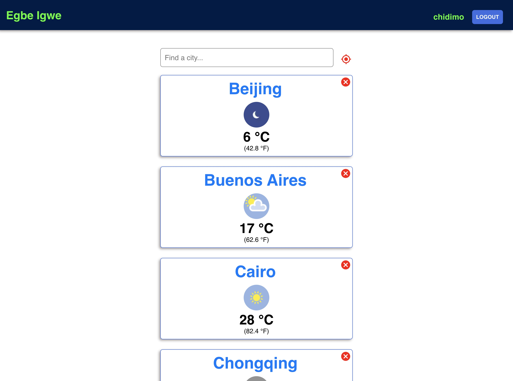
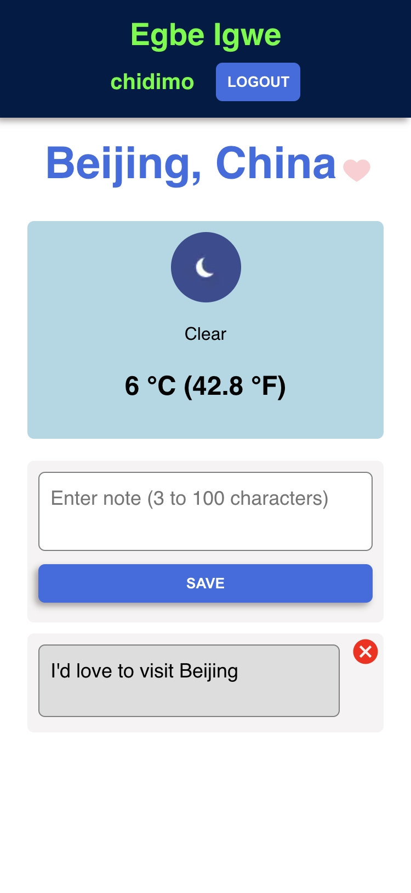
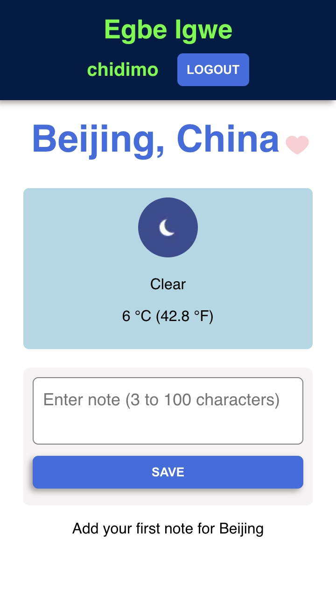
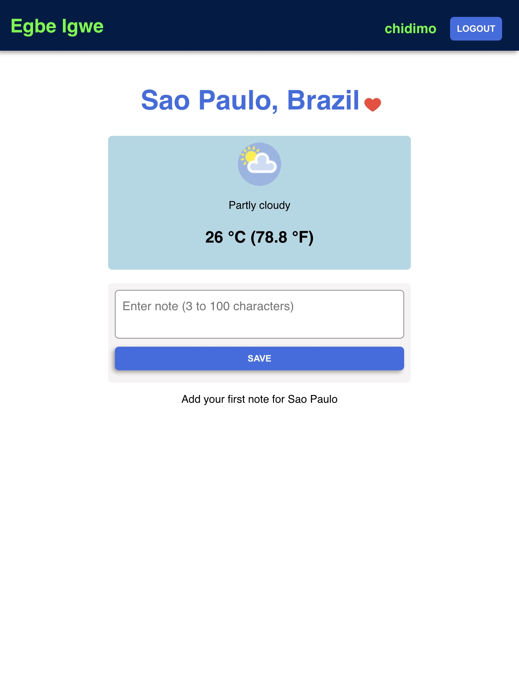

# Egbe Igwe - a minimal weather app

View the current temperature of any city in the world.

## Links

1. Live app: <https://weather-ten-amber.vercel.app/>
1. Github repo: <https://github.com/chidimo/Egbe-Igwe>

## Features

1. Search for any city by name
1. Add notes to any city.
1. Like and unlike cities
1. Automatically detect your location and show the current temperature
1. Works offline (installable). Gets current temperature info once network is restored.









## For developers

1. To run the project locally, clone it to your machine and run the following command

```cmd
yarn
yarn start
```

### Test

Run `yarn test` to run the tests.
